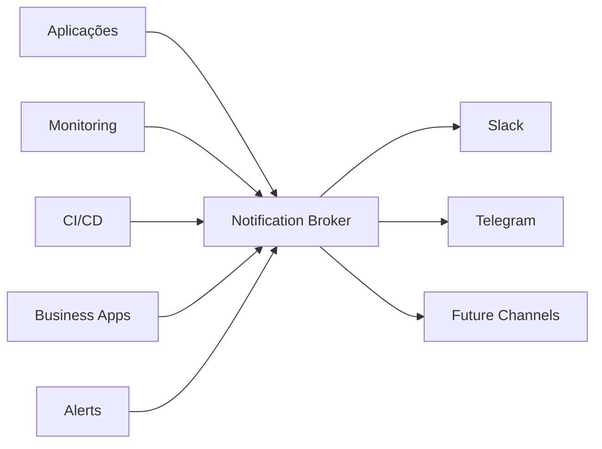

# 🚀 Notification Broker API

> **API para notificações e alertas multi-canal**

[](https://python.org)
[](https://flask.palletsprojects.com)
[](https://blog.cleancoder.com/uncle-bob/2012/08/13/the-clean-architecture.html)
[](https://martinfowler.com/tags/domain%20driven%20design.html)
[](https://docker.com)

**Centralize e gerencie notificações de sistemas e aplicações com suporte a múltiplos canais (Slack, Telegram)**

---

## 📋 Índice

- [Visão Geral](#-visão-geral)
- [Especificações Técnicas](#-especificações-técnicas)
- [Instalação](#-instalação)
- [Configuração](#-configuração)
- [Documentação da API](#-documentação-da-api)
- [Exemplos de Uso](#-exemplos-de-uso)
- [Payloads de Exemplo](#-payloads-de-exemplo)
- [Códigos de Resposta](#-códigos-de-resposta)
- [Troubleshooting](#-troubleshooting)

---

## 🎯 Visão Geral

O **Notification Broker API** é uma solução desenvolvida para centralizar o envio de notificações de múltiplas aplicações para diversos canais de comunicação. Desenvolvido em Python, oferece alta escalabilidade, manutenibilidade e extensibilidade.

### 🎨 Características Principais

- **⚡ Processamento Assíncrono**: Alta performance com Python
- **📱 Multi-Canal**: Slack, Telegram e extensível para novos canais
- **🎨 Mensagens Visuais**: Emojis, cores e formatação
- **🔐 Autenticação Segura**: API Key com middleware de Auth
- **🐳 Production Ready**: Containerizado e escalável

### 💼 Casos de Uso



- 📊 **Alertas de Monitoramento**: CPU, memória, disk, uptime
- 🚀 **Notificações de Deploy**: Status de CI/CD e releases
- ❌ **Alertas de Erro**: Falhas de sistema e aplicações
- 💼 **Eventos de Negócio**: Vendas, conversões, métricas
- 🔔 **Notificações Customizadas**: Qualquer evento da aplicação

---

## 🔧 Especificações Técnicas

### 📐 Arquitetura

```
.
├── Dockerfile
├── Dockerfile.dev
├── Makefile
├── README.md
├── docker-compose-dev.yaml
├── docker-compose.yaml
├── monitoring
│   └── prometheus.yaml
├── requirements.txt
├── scripts
│   └── deploy.sh
└── src
    ├── app_factory.py
    ├── application
    │   ├── dtos
    │   │   └── notification_dto.py
    │   ├── interfaces
    │   │   └── notification_service.py
    │   └── user_cases
    │       └── send_notification.py
    ├── domain
    │   ├── entities
    │   │   └── notification.py
    │   ├── exceptions
    │   │   └── domain_exceptions.py
    │   ├── repositories
    │   │   └── notification_repository.py
    │   ├── services
    │   │   └── notification_channel.py
    │   └── value_objects
    │       ├── channel_config.py
    │       └── log_level.py
    ├── infrastructure
    │   ├── config
    │   │   └── settings.py
    │   ├── external_services
    │   │   ├── slack_service.py
    │   │   └── telegram_service.py
    │   └── repositories
    │       └── in_memory_notification_repository.py
    ├── interface
    │   ├── controllers
    │   │   └── notification_controller.py
    │   ├── exceptions
    │   │   └── api_exceptions.py
    │   ├── middlewares
    │   │   └── auth_middleware.py
    │   └── serializers
    │       └── notification_serializers.py
    └── main.py
```

### 🛠 Stack Tecnológico

| Componente | Tecnologia | Versão | Propósito |
|------------|------------|--------|-----------|
| **Framework** | Flask | 2.3+ | API REST |
| **HTTP Client** | aiohttp | 3.8+ | Requisições assíncronas |
| **Validation** | Pydantic | 2.4+ | Validação de dados |
| **Environment** | python-dotenv | 1.0+ | Variáveis de ambiente |
| **Server** | Gunicorn | 21.2+ | WSGI server |
| **Container** | Docker | Latest | Containerização |

### 📊 Especificações de Performance

- **Throughput**: 1000+ notificações/segundo
- **Latência**: < 100ms por notificação
- **Concorrência**: Processamento assíncrono
- **Memória**: ~50MB base + ~1KB por notificação
- **Escalabilidade**: Horizontal via Docker

### 🔒 Segurança

- **Autenticação**: API Key obrigatória
- **Validação**: Sanitização completa de entrada
- **Rate Limiting**: Configurável por client
- **Logs**: Sem exposição de dados sensíveis
- **HTTPS**: Recomendado para produção

---

## 🛠 Instalação

### 📋 Pré-requisitos

- **Python 3.11+**
- **Docker** e **Docker Compose**
- **Slack Workspace** (para webhook)
- **Bot do Telegram** (opcional)

### 🐳 Instalação com Docker (Recomendado)

```bash
# 1. Clone o repositório
git clone https://github.com/alissonoliveira0607/notification-broker-api.git
cd notification-broker-api

# 2. Configure ambiente
cp .env.example .env
# Edite .env com suas configurações

# 3. Execute
docker-compose up --build

# 4. Teste
curl http://localhost:8000/api/v1/notifications/health
```

### 🐍 Instalação Local

```bash
# 1. Ambiente virtual
python -m venv venv
source venv/bin/activate  # Linux/Mac
# venv\Scripts\activate   # Windows

# 2. Dependências
pip install -r requirements.txt

# 3. Configuração
cp .env.example .env
# Configure suas variáveis

# 4. Execute
python main.py
```

---

## ⚙️ Configuração

### 🌍 Variáveis de Ambiente

```env
# .env
API_KEY=sua-chave-super-secreta-aqui
DEBUG=false
HOST=0.0.0.0
PORT=8000
LOG_LEVEL=INFO
```

### 📱 Configuração do Slack

1. **Acesse**: https://api.slack.com/apps
2. **Crie uma App** → **Incoming Webhooks**
3. **Ative Incoming Webhooks** → **Add New Webhook to Workspace**
4. **Selecione o canal** e **copie a URL**

Formato esperado:
```
https://hooks.slack.com/services/T123ABC456/B789DEF012/xyzABC123def456ghi789
```

### 🤖 Configuração do Telegram

1. **Fale com @BotFather** no Telegram
2. **Execute**: `/newbot`
3. **Siga as instruções** e anote o `bot_token`
4. **Adicione o bot** ao grupo/canal
5. **Obtenha chat_id**: https://api.telegram.org/bot`<token>`/getUpdates

---

## 📡 Documentação da API

### 🔗 Base URL

```
http://localhost:8000/api/v1/notifications
```

### 🛡 Autenticação


**Headers obrigatórios: para todas as rotas exceto `/health`.**
```http
X-API-Key: your-secret-api-key
Content-Type: application/json
```

**Headers opcionais para canais:**
```http
Slack-Webhook-Url: https://hooks.slack.com/services/YOUR/SLACK/WEBHOOK
Telegram-Bot-Token: YOUR_BOT_TOKEN
Telegram-Chat-Id: YOUR_CHAT_ID
```


**Headers aceitos:**
```http
X-API-Key: sua-chave-secreta
Authorization: Bearer sua-chave-secreta
Authorization: sua-chave-secreta
```

### 📋 Endpoints

#### `GET /health`

**Descrição**: Verificar saúde da API

**Resposta**:
```json
{
  "status": "healthy",
  "service": "notification-broker"
}
```

#### `POST /send`

**Descrição**: Enviar notificação para canais especificados

**Headers**:
```http
X-API-Key: string (obrigatório)
Content-Type: application/json (obrigatório)
Slack-Webhook-Url: string (opcional)
Telegram-Bot-Token: string (opcional)
Telegram-Chat-Id: string (opcional)
```

**Body Schema**:
```json
{
  "title": "string (obrigatório, max 200 chars)",
  "message": "string (obrigatório, max 2000 chars)",
  "level": "INFO|WARNING|ERROR|CRITICAL|DISASTER (obrigatório)",
  "source": "string (opcional, max 100 chars)",
  "metadata": {
    "key": "value (opcional, object)"
  },
  "channels": {
    "slack": {
      "webhook_url": "string (obrigatório para Slack)",
      "channel": "string (opcional, ex: #alerts)",
      "username": "string (opcional, default: NotificationBot)"
    },
    "telegram": {
      "bot_token": "string (obrigatório para Telegram)",
      "chat_id": "string (obrigatório para Telegram)",
      "parse_mode": "string (opcional, default: Markdown)"
    }
  }
}
```

### 📊 Níveis de Log

| Nível | Emoji | Cor (Slack) | Prioridade | Uso |
|-------|-------|-------------|------------|-----|
| `INFO` | ℹ️ | 🟢 Verde | 1 | Informações gerais |
| `WARNING` | ⚠️ | 🟠 Laranja | 2 | Avisos e alertas |
| `ERROR` | ❌ | 🔴 Vermelho | 3 | Erros recuperáveis |
| `CRITICAL` | 🚨 | 🟡 Vermelho escuro | 4 | Erros críticos |
| `DISASTER` | 💀 | 🟣 Roxo | 5 | Falhas catastróficas |

---

## 💡 Exemplos de Uso

### 🏥 Health Check

```bash
curl -X GET http://localhost:8000/api/v1/notifications/health
```

**Resposta**:
```json
{
  "status": "healthy",
  "service": "notification-broker"
}
```

### 💬 Slack Apenas

#### Via Header
```bash
curl -X POST http://localhost:8000/api/v1/notifications/send \
  -H "X-API-Key: your-secret-api-key" \
  -H "Content-Type: application/json" \
  -H "Slack-Webhook-Url: https://hooks.slack.com/services/T123/B456/abc123" \
  -d '{
    "title": "✅ Deploy Concluído",
    "message": "Nova versão v2.1.4 foi deployada com sucesso em produção",
    "level": "INFO",
    "source": "ci-cd-pipeline",
    "metadata": {
      "version": "v2.1.4",
      "environment": "production",
      "duration": "3m 45s",
      "tests_passed": 156
    }
  }'
```

#### Via Body
```bash
curl -X POST http://localhost:8000/api/v1/notifications/send \
  -H "X-API-Key: your-secret-api-key" \
  -H "Content-Type: application/json" \
  -d '{
    "title": "⚠️ CPU Alto no Servidor",
    "message": "O servidor prod-api-01 está com 85% de uso de CPU há mais de 10 minutos",
    "level": "WARNING",
    "source": "monitoring-system",
    "metadata": {
      "server": "prod-api-01",
      "cpu_usage": "85%",
      "memory_usage": "72%",
      "threshold": "80%",
      "duration": "10 minutes"
    },
    "channels": {
      "slack": {
        "webhook_url": "https://hooks.slack.com/services/T123/B456/abc123",
        "channel": "#alerts",
        "username": "MonitoringBot"
      }
    }
  }'
```

### 🤖 Telegram Apenas

#### Via Headers
```bash
curl -X POST http://localhost:8000/api/v1/notifications/send \
  -H "X-API-Key: your-secret-api-key" \
  -H "Content-Type: application/json" \
  -H "Telegram-Bot-Token: 1234567890:ABCdefGHIjklMNOpqrsTUVwxyZ" \
  -H "Telegram-Chat-Id: -1001234567890" \
  -d '{
    "title": "💾 Backup Concluído",
    "message": "Backup automático dos dados foi finalizado com sucesso",
    "level": "INFO",
    "source": "backup-service",
    "metadata": {
      "backup_size": "2.5 GB",
      "duration": "45 minutes",
      "files_backed_up": 15420,
      "compression_ratio": "68%"
    }
  }'
```

#### Via Body
```bash
curl -X POST http://localhost:8000/api/v1/notifications/send \
  -H "X-API-Key: your-secret-api-key" \
  -H "Content-Type: application/json" \
  -d '{
    "title": "❌ Falha na API Externa",
    "message": "A API de geolocalização está retornando erro 429. Limite de requisições excedido.",
    "level": "ERROR",
    "source": "geolocation-service",
    "metadata": {
      "api_provider": "Google Maps API",
      "current_usage": "50000 requests",
      "daily_limit": "50000 requests",
      "reset_time": "2024-06-12T00:00:00Z"
    },
    "channels": {
      "telegram": {
        "bot_token": "1234567890:ABCdefGHIjklMNOpqrsTUVwxyZ",
        "chat_id": "-1001234567890",
        "parse_mode": "Markdown"
      }
    }
  }'
```

### 🔄 Ambos os Canais

```bash
curl -X POST http://localhost:8000/api/v1/notifications/send \
  -H "X-API-Key: your-secret-api-key" \
  -H "Content-Type: application/json" \
  -d '{
    "title": "🚨 Falha Crítica no Sistema",
    "message": "O banco de dados principal está inacessível. Sistema em modo degradado. Equipe de emergência acionada.",
    "level": "CRITICAL",
    "source": "database-monitor",
    "metadata": {
      "database": "postgres-primary",
      "connection_pool": "exhausted",
      "last_response": "30 seconds ago",
      "failover_status": "in_progress",
      "estimated_recovery": "15 minutes",
      "incident_id": "INC-2024-067"
    },
    "channels": {
      "slack": {
        "webhook_url": "https://hooks.slack.com/services/T123/B456/abc123",
        "channel": "#critical-alerts",
        "username": "CriticalAlertBot"
      },
      "telegram": {
        "bot_token": "1234567890:ABCdefGHIjklMNOpqrsTUVwxyZ",
        "chat_id": "-1001234567890"
      }
    }
  }'
```

### 💀 Notificação DISASTER

```bash
curl -X POST http://localhost:8000/api/v1/notifications/send \
  -H "X-API-Key: your-secret-api-key" \
  -H "Content-Type: application/json" \
  -d '{
    "title": "💀 EMERGÊNCIA: Datacenter Principal Offline",
    "message": "O datacenter us-east-1 está completamente offline. Todos os serviços indisponíveis. Plano de disaster recovery ativado imediatamente.",
    "level": "DISASTER",
    "source": "infrastructure-monitor",
    "metadata": {
      "datacenter": "us-east-1",
      "affected_services": ["api", "web", "database", "cache", "cdn"],
      "customers_affected": 15000,
      "estimated_recovery": "2-4 hours",
      "dr_status": "activating",
      "incident_commander": "Maria Santos",
      "emergency_contact": "+55 11 99999-9999",
      "incident_id": "INC-2024-DISASTER-001"
    },
    "channels": {
      "slack": {
        "webhook_url": "https://hooks.slack.com/services/T123/B456/abc123",
        "channel": "#disaster-recovery"
      },
      "telegram": {
        "bot_token": "1234567890:ABCdefGHIjklMNOpqrsTUVwxyZ",
        "chat_id": "-1001234567890"
      }
    }
  }'
```

---

## 📋 Payloads de Exemplo

### 📊 Monitoramento de Sistema

```json
{
  "title": "📈 Relatório de Performance Semanal",
  "message": "Métricas de performance da última semana foram compiladas e estão disponíveis para análise",
  "level": "INFO",
  "source": "performance-monitor",
  "metadata": {
    "period": "2024-06-04 to 2024-06-11",
    "avg_response_time": "145ms",
    "uptime": "99.97%",
    "total_requests": 2847592,
    "error_rate": "0.12%",
    "top_endpoint": "/api/users",
    "slowest_endpoint": "/api/reports/heavy",
    "peak_rps": "1250 req/s",
    "avg_cpu": "34%",
    "avg_memory": "58%"
  },
  "channels": {
    "slack": {
      "webhook_url": "https://hooks.slack.com/services/T123/B456/abc123",
      "channel": "#performance",
      "username": "PerformanceBot"
    }
  }
}
```

### 🛒 E-commerce

```json
{
  "title": "🎉 Pico de Vendas Detectado!",
  "message": "Vendas aumentaram 340% na última hora devido à promoção flash. Sistema operando com carga alta mas estável.",
  "level": "WARNING",
  "source": "sales-monitor",
  "metadata": {
    "sales_increase": "340%",
    "current_rps": "850 req/s",
    "normal_rps": "250 req/s",
    "revenue_last_hour": "R$ 45.230,00",
    "orders_last_hour": 234,
    "conversion_rate": "8.2%",
    "top_product": "Smartphone XYZ",
    "payment_gateway_status": "stable",
    "inventory_alerts": 3
  },
  "channels": {
    "telegram": {
      "bot_token": "1234567890:ABCdefGHIjklMNOpqrsTUVwxyZ",
      "chat_id": "-1001234567890"
    }
  }
}
```

### 🔐 Segurança

```json
{
  "title": "🛡️ Tentativa de Invasão Detectada",
  "message": "Sistema de segurança detectou múltiplas tentativas de login suspeitas. Possível ataque de força bruta em andamento.",
  "level": "CRITICAL",
  "source": "security-monitor",
  "metadata": {
    "attack_type": "brute_force",
    "failed_attempts": 1247,
    "source_ips": ["192.168.1.100", "10.0.0.45", "172.16.0.33"],
    "target_accounts": ["admin", "root", "usuario"],
    "time_window": "last 10 minutes",
    "blocked_ips": 3,
    "firewall_rules_added": 15,
    "geolocation": "Multiple countries",
    "threat_score": "high"
  },
  "channels": {
    "slack": {
      "webhook_url": "https://hooks.slack.com/services/T123/B456/abc123",
      "channel": "#security-alerts",
      "username": "SecurityBot"
    },
    "telegram": {
      "bot_token": "1234567890:ABCdefGHIjklMNOpqrsTUVwxyZ",
      "chat_id": "-1001234567890"
    }
  }
}
```

### ⚙️ DevOps/Infraestrutura

```json
{
  "title": "🔄 Auto Scaling Ativado",
  "message": "Sistema detectou alta carga e ativou scaling automático. Novas instâncias sendo provisionadas para atender demanda.",
  "level": "INFO",
  "source": "auto-scaler",
  "metadata": {
    "trigger": "cpu_threshold_exceeded",
    "current_instances": 3,
    "target_instances": 8,
    "cpu_usage": "87%",
    "memory_usage": "74%",
    "load_average": "4.2",
    "estimated_provision_time": "3 minutes",
    "cloud_provider": "AWS",
    "instance_type": "t3.large",
    "region": "us-east-1",
    "cost_impact": "+$45/hour"
  },
  "channels": {
    "slack": {
      "webhook_url": "https://hooks.slack.com/services/T123/B456/abc123",
      "channel": "#infrastructure"
    },
    "telegram": {
      "bot_token": "1234567890:ABCdefGHIjklMNOpqrsTUVwxyZ",
      "chat_id": "-1001234567890"
    }
  }
}
```

---

## 📊 Códigos de Resposta

### ✅ Respostas de Sucesso

#### `200 OK` - Health Check
```json
{
  "status": "healthy",
  "service": "notification-broker"
}
```

#### `201 Created` - Notificação Enviada
```json
{
  "success": true,
  "data": {
    "notification_id": "123e4567-e89b-12d3-a456-426614174000",
    "timestamp": "2024-06-11T14:30:00.375397",
    "channels": {
      "slack": {
        "success": true,
        "response": {
          "status": "sent",
          "response": "ok"
        }
      },
      "telegram": {
        "success": true,
        "response": {
          "status": "sent",
          "response": {
            "ok": true,
            "result": {
              "message_id": 123,
              "chat": {"id": -1001234567890},
              "date": 1623456789
            }
          }
        }
      }
    }
  }
}
```

### ❌ Respostas de Erro

#### `400 Bad Request` - Dados Inválidos
```json
{
  "error": "Missing required field: title"
}
```

```json
{
  "error": "Invalid log level: INVALID_LEVEL"
}
```

```json
{
  "error": "At least one notification channel must be configured with valid parameters"
}
```

#### `401 Unauthorized` - Não Autenticado
```json
{
  "error": "Invalid or missing API key"
}
```

#### `500 Internal Server Error` - Erro Interno
```json
{
  "error": "Internal server error"
}
```

#### Erro Parcial - Canal Falhou
```json
{
  "success": true,
  "data": {
    "notification_id": "123e4567-e89b-12d3-a456-426614174000",
    "timestamp": "2024-06-11T14:30:00.375397",
    "channels": {
      "slack": {
        "success": true,
        "response": {"status": "sent"}
      },
      "telegram": {
        "success": false,
        "error": "Network error sending to Telegram: Connection timeout"
      }
    }
  }
}
```

---

## 📈 Extensibilidade

### Adicionando Novos Canais

1. **Crie o serviço:**
   ```python
   # src/infrastructure/external_services/email_service.py
   class EmailNotificationChannel(NotificationChannelInterface):
       async def send(self, notification, config):
           # Implementar envio de email
           pass
       
       def validate_config(self, config):
           # Validar configuração
           pass
   ```

2. **Registre no use case:**
   ```python
   # Em app_factory.py
   email_channel = EmailNotificationChannel()
   notification_service = SendNotificationUseCase(
       # ...
       email_channel=email_channel
   )
   ```

3. **Adicione value object:**
   ```python
   @dataclass(frozen=True)
   class EmailConfig:
       smtp_server: str
       username: str
       password: str
       from_email: str
       to_emails: List[str]
   ```
---


## 🎨 Formato das Mensagens

### 💬 Slack

```
ℹ️ ✅ Deploy Concluído

Nova versão v2.1.4 foi deployada com sucesso em produção

Level: INFO                    Timestamp: 2024-06-11 14:30:00 UTC
Source: ci-cd-pipeline

Metadata:
• version: v2.1.4
• environment: production  
• duration: 3m 45s
• tests_passed: 156

Notification ID: 123e4567-e89b-12d3-a456-426614174000
```

### 🤖 Telegram

```
ℹ️ *✅ Deploy Concluído*

📝 Nova versão v2.1.4 foi deployada com sucesso em produção

🏷️ *Level:* `INFO`
🕐 *Time:* `2024-06-11 14:30:00 UTC`
🔍 *Source:* `ci-cd-pipeline`

📊 *Metadata:*
• *version:* `v2.1.4`
• *environment:* `production`
• *duration:* `3m 45s`
• *tests_passed:* `156`

🆔 `123e4567-e89b-12d3-a456-426614174000`
```

---

## 🔧 Troubleshooting

### ❓ Problemas Comuns

#### 1. **Erro 401 - Unauthorized**
- Verifique se a API key está configurada corretamente
- Confirme o header `X-API-Key` na requisição
- Teste: `curl -H "X-API-Key: sua-chave" http://localhost:8000/api/v1/notifications/health`

#### 2. **Erro 400 - Campos obrigatórios**
- `title` e `message` são obrigatórios
- `level` deve ser: INFO, WARNING, ERROR, CRITICAL ou DISASTER
- Pelo menos um canal deve ser configurado

#### 3. **Slack retorna erro 404**
- Webhook URL inválida ou expirada
- Teste direto: `curl -X POST "SEU_WEBHOOK" -d '{"text":"teste"}'`
- Verifique se a URL começa com `https://hooks.slack.com/`

#### 4. **Telegram não recebe mensagens**
- Verifique `bot_token` e `chat_id`
- Bot deve estar adicionado ao chat/grupo
- Teste: `curl "https://api.telegram.org/bot<TOKEN>/sendMessage" -d "chat_id=<CHAT_ID>&text=teste"`

#### 5. **Container não inicia**
- Verifique se a porta 8000 está disponível: `netstat -tulpn | grep :8000`
- Logs: `docker-compose logs notification-api`
- Rebuilda: `docker-compose down && docker-compose up --build`

### 🧪 Testes de Validação

```bash
# 1. Health check
curl http://localhost:8000/api/v1/notifications/health

# 2. Teste de autenticação (deve falhar)
curl -X POST http://localhost:8000/api/v1/notifications/send \
  -H "Content-Type: application/json" \
  -d '{"title":"Teste","message":"Sem auth","level":"INFO"}'

# 3. Teste de webhook Slack direto
curl -X POST "SEU_WEBHOOK_SLACK" \
  -H "Content-Type: application/json" \
  -d '{"text": "Teste direto Slack"}'

# 4. Teste de bot Telegram direto  
curl "https://api.telegram.org/bot<TOKEN>/sendMessage" \
  -d "chat_id=<CHAT_ID>&text=Teste direto Telegram"
```


---

## 🤝 Contribuição

1. **Fork** o projeto
2. Crie uma **feature branch**: `git checkout -b feature/nova-funcionalidade`
3. **Commit** suas mudanças: `git commit -am 'Adiciona nova funcionalidade'`
4. **Push** para a branch: `git push origin feature/nova-funcionalidade`
5. Abra um **Pull Request**

### Guidelines

- Siga os princípios da **Clean Architecture**
- Use **tipagem estática**
- Documente **APIs públicas**

## 📝 Changelog

### v1.0.0 (2025-06-10)
- ✨ Implementação inicial da API
- 📱 Suporte para Slack e Telegram
- 🔐 Autenticação via API-KEY
- 🐳 Containerização completa
- 📚 Documentação completa

## 📄 Licença

Este projeto está licenciado sob a **MIT License**.

## 🆘 Suporte

- **Issues**: Reporte bugs no GitHub Issues
- **Documentação**: Veja a documentação completa na Wiki
- **Discussões**: Use GitHub Discussions para perguntas


---

<div align="center">

**Desenvolvido por Alisson Oliveira**

*Centralize suas notificações, simplifique sua vida!* 🚀

</div>

<div align="center">

[](https://www.linkedin.com/in/alissonapoliveira/)
[](https://github.com/alissonoliveira0607)

</div>
